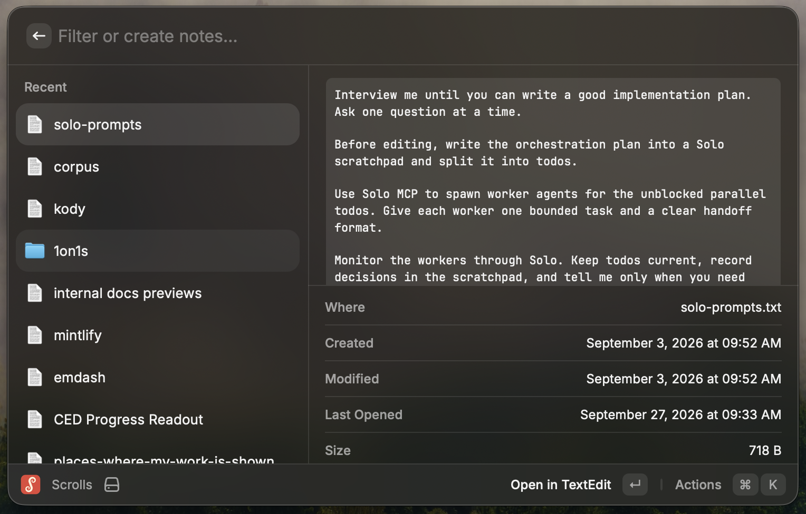

# Scrolls


> A scroll is a spell you _cast_ (RAY-cast), a paper covered in _notes_, and the thing you do to a long list (of notes). Get it? ...You get it.

Raycast extension that turns a folder of notes into a searchable launcher.



## What it does

- **Search** every note by name, sorted by most recently opened
- **Preview** note contents and metadata (created, modified, last opened, size) inline
- **Browse** top-level folders
- **Create** a note by typing its name and hitting Enter
- **Open** in TextEdit or any app, reveal in Finder, copy the path
- **Delete** notes and folders to Trash (with confirmation)
- **Configure** the notes folder in Raycast Settings (default: `~/Documents/notes`)

## Install

Requires [Raycast](https://www.raycast.com), [Node LTS](https://nodejs.org), and [pnpm](https://pnpm.io).

Clone this repo, then:

```bash
# One-time setup
pnpm install
```

In Raycast, run **Import Extension** and select the cloned `scrolls` directory. This import is also a one-time setup; the extension stays installed when you stop `pnpm dev` with `Ctrl-C`.

When you want to develop the extension with hot reloading, run:

```bash
pnpm dev
```

Keep that command running while hacking, and stop it with `Ctrl-C` when you're done.

Then finish setup in **Raycast Settings → Extensions**, search for **Scrolls**:

- **Alias** — recommended: set a short one (e.g. `n`) to surface the command as the top result in root search. Without an alias, search for `Scrolls` and hit Enter.
- **Notes Directory** — where your notes live (default: `~/Documents/notes`)

## Usage

Open Raycast, type `scrolls` (or just `n`), hit Enter.

- The list shows recent notes and folders, most recently opened first
- Type to filter — the right pane previews the highlighted note
- `Enter` opens a note in TextEdit, or drills into a folder (**Back to All Notes** returns)
- Type a new note's name, then `Enter` on the **Create** row to make it
- Shortcuts: `⌘N` new note · `⌘O` open directory · `⌘⌫` delete (confirm, then Trash)
